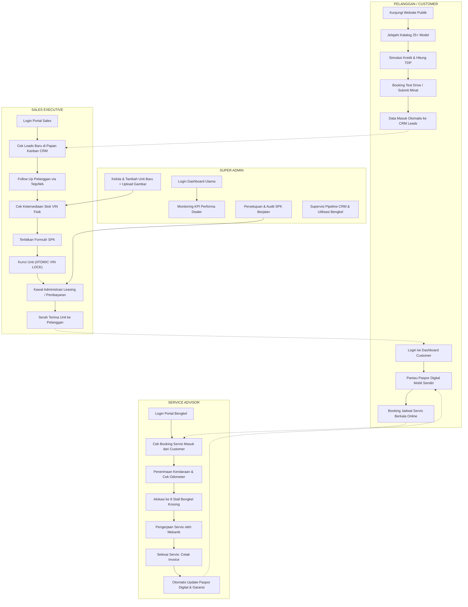

# 📋 DOKUMENTASI LENGKAP APLIKASI ROCKETDRIVE
## Integrated Automotive Sales & After-Sales Management System

---

## 🔷 1. IDENTITAS & DESKRIPSI UMUM APLIKASI

**Nama Aplikasi:** ROCKETDRIVE — Sistem Terintegrasi Penjualan & Layanan Purna Jual Otomotif  
**Versi:** 2026  
**Domain Deployment:** rocketdrive.tplp004.com (Hostinger)  
**Bahasa:** HTML, CSS (TailwindCSS CDN), JavaScript (Vanilla), PHP (Backend API)  
**Database:** MySQL (u975115372_Rocketdrive123)  
**Font:** Outfit + Inter (Google Fonts)

**Deskripsi:**  
ROCKETDRIVE adalah ekosistem digital dealer otomotif terpadu yang menggabungkan dua bagian utama dalam satu file:
1. **Landing Page Publik** — Showroom digital yang bisa diakses siapa saja (sebelum login)
2. **Dashboard Internal** — Portal manajemen dealer yang hanya bisa diakses setelah login, dengan hak akses berbeda berdasarkan role pengguna

---

## 🔷 2. TEKNOLOGI YANG DIGUNAKAN

| Layer | Teknologi |
|-------|-----------|
| Frontend | HTML5, CSS3 (Tailwind CDN), Vanilla JavaScript (ES6+) |
| Backend API | PHP 8.1 (PDO MySQL) |
| Database | MySQL 8 dengan 9 tabel relasional |
| Hosting | Hostinger (Shared Hosting) |
| Font | Google Fonts (Outfit, Inter) |
| Icon | SVG Inline (Heroicons) |
| Video | MP4 autoplay background (Video Halaman Utama.mp4) |
| File Upload | Multipart form-data image upload via `api/upload.php` ke folder `uploads/` |

**Catatan:** Tidak menggunakan framework frontend berat (React/Vue/Angular). Seluruh UI dibangun dengan HTML + Vanilla JS dalam 1 file `index.html` (±2.881 baris) dengan performa kilat dan animasi interaktif modern.

---

## 🔷 3. STRUKTUR FILE APLIKASI

```
public_html/ (Hostinger / Root Workspace)
├── index.html              ← Aplikasi utama (Landing page publik + Dashboard internal)
├── favicon.svg             ← Logo ROCKETDRIVE (lightning bolt icon)
├── Video Halaman Utama.mp4 ← Video background hero section
├── [25 gambar kendaraan]   ← .jpg/.jpeg/.png (Toyota, Honda, Suzuki, dll)
├── uploads/                ← Direktori penyimpanan gambar unit baru yang diunggah
├── api/
│   ├── db.php              ← Koneksi database (PDO MySQL)
│   ├── auth.php            ← Autentikasi login (bcrypt password)
│   ├── vehicles.php        ← CRUD katalog kendaraan + nomor rangka VIN
│   ├── upload.php          ← Endpoint upload file gambar (JPG, PNG, WebP)
│   ├── spk.php             ← Surat Pesanan Kendaraan & Atomic VIN Lock
│   ├── leads.php           ← Data prospek pelanggan (CRM Pipeline)
│   ├── services.php        ← Booking & riwayat servis bengkel
│   ├── passport.php        ← Paspor Digital Kendaraan
│   └── test_db.php         ← Diagnostik status koneksi database
└── u975115372_Rocketdrive123.sql  ← Skema database MySQL + data awal
```

---

## 🔷 4. DATABASE — STRUKTUR TABEL (9 Tabel)

**Nama Database:** `u975115372_Rocketdrive123`

| No | Nama Tabel | Fungsi | Jumlah Data Awal |
|----|-----------|--------|-----------------|
| 1 | `users` | Data akun pengguna & penetapan role | 4 akun |
| 2 | `vehicles` | Katalog master model kendaraan | 25 model |
| 3 | `vehicle_vins` | Nomor rangka fisik unit (VIN) & status stok | 28 VIN |
| 4 | `spks` | Surat Pesanan Kendaraan & data pembeli | 3 SPK |
| 5 | `leads` | Pipeline prospek pelanggan (CRM) | 5 leads |
| 6 | `leasing_partners` | Daftar mitra pembiayaan & suku bunga | 4 mitra |
| 7 | `service_bookings` | Booking slot servis bengkel | 4 booking |
| 8 | `service_records` | Riwayat servis berkala & perbaikan | 2 record |
| 9 | `digital_passports` | Paspor digital kendaraan & garansi | 2 paspor |

### Tabel `users` (Role Pengguna):
```sql
id | name              | email                       | role             | status
---|-------------------|-----------------------------|------------------|-------
1  | Alexander Pratama | admin@rocketdrive.test      | SUPER_ADMIN      | ACTIVE
2  | Doni Wijaya       | sales@rocketdrive.test      | SALES_EXECUTIVE  | ACTIVE
3  | Agus Pratama      | service@rocketdrive.test    | SERVICE_ADVISOR  | ACTIVE
4  | Budi Santoso      | customer@rocketdrive.test   | CUSTOMER         | ACTIVE
```
**Password seluruh akun default:** `Rocketdrive123` (bcrypt hash)

---

## 🔷 5. HALAMAN LANDING PAGE (PUBLIK — SEBELUM LOGIN)

### 5.1 — Animasi Loading Screen
- Animasi loading screen dengan mobil SVG yang bergerak dari kiri ke kanan
- Progress bar yang mengisi dari 0% ke 100%
- Teks status berganti secara dinamis: "Menghubungkan Registri Inventaris VIN...", "Memuat Katalog 25+ Model...", dll
- Loading hilang otomatis setelah inisialisasi selesai dan konten utama muncul halus

### 5.2 — Bilah Pengumuman (Announcement Bar)
- Teks bergulir di bagian paling atas
- Info: "SHOWROOM RESMI ROCKETDRIVE INDONESIA", "Garansi Resmi APM 5 Tahun / 100.000 KM"
- Info promo: "Program Suku Bunga Kredit 0% Spesial 2026"
- Nomor darurat 24 jam: 1500-888 & Lokasi: Senayan & PIK 2

### 5.3 — Navbar / Header Utama (Sticky Glassmorphism)
- Logo ROCKETDRIVE dengan ikon lightning bolt + gradasi biru-cyan
- Badge versi "2026"
- Menu navigasi: Beranda | Katalog Kendaraan | Simulasi Kredit | Paspor Digital | Keunggulan
- Nomor hotline (021) 8899-7700 dengan status dot hijau aktif
- Tombol **"MASUK / LOGIN"** bergradasi biru-cyan untuk membuka modal login
- Efek kaca (glassmorphism) dengan backdrop blur

### 5.4 — Hero Section (Halaman Utama)
- **Video background** fullscreen autoplay, muted, loop (`Video Halaman Utama.mp4`)
- Overlay gradient gelap di atas video agar teks terbaca kontras
- Judul hero: **"ROCKETDRIVE"** + *Drive Your Next Journey.*
- Sub-judul: Deskripsi platform otomotif digital terintegrasi
- 2 Tombol CTA: "Jelajahi Kendaraan" + "Hitung Angsuran Kredit"
- 4 Kotak statistik: "25+ Model", "4.50% p.a.", "5 Thn / 100rb KM", "100% VIN Asli"
- Animasi scroll reveal saat dimuat

### 5.5 — Showroom & Katalog Kendaraan (Section #katalog)
- **25+ model kendaraan** dari 8 merek ternama: Toyota, Honda, Suzuki, Daihatsu, Hyundai, BYD, Chery
- Setiap kartu kendaraan menampilkan: Foto, Merek & Model, Kategori, Harga OTR, Bahan Bakar, Kapasitas Kursi, Tombol Detail
- **Filter Kategori:** SEMUA | CITY CAR | MPV | SUV | CROSSOVER | LISTRIK (EV) | HYBRID
- **Search Bar:** Pencarian berdasarkan nama/merek secara real-time
- **Tombol "+ Tambah Mobil Baru"** — membuka modal form untuk menambah unit baru ke database
- Hover effect kartu: elevasi ke atas + glowing border biru

### 5.6 — Modal Detail Kendaraan & Test Drive
- Muncul saat tombol "Lihat Detail" pada kartu diklik
- Menampilkan: Gambar resolusi tinggi, Spesifikasi teknis, Transmisi, Mesin, Garansi resmi
- Tombol **"Booking Test Drive"** untuk mengajukan uji berkendara langsung

### 5.7 — Simulasi Kredit (Section #simulasi)
- **Pilih model kendaraan** dari dropdown
- **Pilih mitra leasing:** Mandiri Tunas Finance (4.5%), ACC (4.7%), Adira Finance (4.9%), BCA Finance (4.2%)
- **Slider DP interaktif:** 15% – 50% (step 5%, default 20%)
- **Pilih tenor:** 12 / 24 / 36 / 48 / 60 bulan
- Hasil kalkulasi otomatis real-time:
  - Harga OTR Jakarta
  - Uang Muka Murni (DP)
  - Biaya Administrasi
  - Premi Asuransi All Risk
  - Angsuran Pertama (ADDM)
  - **Total TDP (Total Pembayaran Pertama)**
  - **Estimasi Angsuran Bulanan**

### 5.8 — Paspor Digital Kendaraan (Section #paspor)
- Preview paspor digital contoh (Toyota Avanza)
- Menampilkan: Nomor VIN, Model, Warna, Nomor Mesin, Nama Pemilik
- Status Garansi, Odometer terakhir, Tanggal Serah Terima
- **Timeline riwayat servis** terstruktur secara kronologis

### 5.9 — Keunggulan & Layanan (Section #mengapa)
- 4 pilar keunggulan sistem:
  1. 🚗 Inventaris Fisik VIN Real-time
  2. 💳 Pembiayaan Cerdas & Multi-Leasing
  3. 🔒 Penguncian Atomik SPK (Anti Double-Selling)
  4. 🔧 Paspor Digital Servis Berkala

### 5.10 — Footer Publik
- 4 Kolom informasi resmi dealer, legalitas, jam operasional, dan kontak darurat

---

## 🔷 6. MODAL LOGIN & AUTENTIKASI

- Overlay modal interaktif
- Input Email & Password dengan fitur toggle show/hide kata sandi
- Tombol verifikasi dengan spinner loading
- Request dikirimkan via POST JSON ke `api/auth.php`
- Verifikasi password aman menggunakan standard PHP `password_verify()` (bcrypt)
- Sesi aktif menyimpan token profil, nama pengguna, dan role hak akses
- Otomatis membuka antarmuka dashboard sesuai role pengguna

---

## 🔷 7. DASHBOARD INTERNAL (SETELAH LOGIN)

### 7.1 — Struktur Layout Dashboard
- **Layout 2-Kolom Modern:** Sidebar tetap di kiri (264px) + Area kerja konten utama
- Topbar responsif dengan indikator status sistem, tombol aksi instan, dan notifikasi profil

### 7.2 — Sidebar Navigasi
- Logo ROCKETDRIVE dengan tanda "PORTAL DEALER RESMI"
- Kartu Profil Aktif: Avatar inisial nama, Nama lengkap, Badge Role berwarna khusus
- Menu navigasi 6 tab dinamis:
  - 📊 Ringkasan & KPI
  - 📦 Inventaris Fisik (VIN)
  - 📄 SPK & Penguncian VIN
  - 👥 Prospek Pelanggan (CRM)
  - 🔧 Slot Kapasitas Servis
  - 🪪 Paspor Digital Kendaraan
- Tombol "Lihat Showroom Publik" & Tombol "Keluar (Logout)"

---

## 🔷 8. ROLE-BASED ACCESS CONTROL (RBAC) — HAK AKSES

Sistem menerapkan proteksi akses ketat berbasis 4 role:

| Tab Menu | SUPER_ADMIN | SALES_EXECUTIVE | SERVICE_ADVISOR | CUSTOMER |
|----------|:-----------:|:---------------:|:---------------:|:--------:|
| 📊 Ringkasan & KPI | ✅ | ✅ | ✅ | ✅ |
| 📦 Inventaris Fisik (VIN) | ✅ | ✅ | ✅ | ❌ |
| 📄 SPK & Penguncian VIN | ✅ | ✅ | ❌ | ❌ |
| 👥 Prospek Pelanggan (CRM) | ✅ | ✅ | ❌ | ❌ |
| 🔧 Slot Kapasitas Servis | ✅ | ❌ | ✅ | ✅ |
| 🪪 Paspor Digital Kendaraan | ✅ | ❌ | ✅ | ✅ |

- Menu yang tidak berhak diakses otomatis disembunyikan dari DOM
- Dashboard sub-view menampilkan metrik KPI yang spesifik untuk masing-masing pekerjaan

---

## 🔷 9. FITUR DASHBOARD — TAB RINGKASAN & KPI

- **Super Admin:** Total Armada Tersedia, SPK Aktif Berjalan, Prospek Pipeline CRM, Utilisasi Stall Bengkel
- **Sales Executive:** Target Bulanan, Angka Closing, SPK Pending, Unit Ready Stock
- **Service Advisor:** Booking Hari Ini, Stall Aktif Beroperasi, Unit Selesai Servis, Antrean Menunggu
- **Customer:** Profil Kendaraan Pribadi, Masa Berlaku Garansi, Jadwal Servis Mendatang, Status Booking

---

## 🔷 10. FITUR DASHBOARD — TAB INVENTARIS FISIK (VIN)

- Tabel inventaris terhubung ke database `vehicle_vins`
- Data per baris: Nomor Rangka VIN, Model Kendaraan, Warna Fisik, Lokasi Stok, dan Status Stok (`READY` / `BOOKED` / `SOLD`)
- Pencarian dan filter status stok unit
- Menjamin setiap mobil yang dipajang memiliki unit fisik nyata di gudang

---

## 🔷 11. FITUR DASHBOARD — TAB SPK & PENGUNCIAN ATOMIK VIN

### Form Penerbitan SPK:
- Pemilihan model mobil & alokasi nomor rangka fisik VIN
- Input data identitas pemesan (Nama KTP, No. Telepon/WA, NIK 16 digit, Domisili)
- Pemilihan skema pembayaran (Cash / Leasing Partner)
- Besaran tanda jadi (Booking Fee)
- **Mekanisme Atomic VIN Lock:** Saat tombol simpan diklik, status VIN otomatis terkunci menjadi `BOOKED` di database, mencegah risiko bentrok pesanan antar sales executive (anti double-selling).

---

## 🔷 12. FITUR DASHBOARD — TAB PROSPEK PELANGGAN (CRM)

- Papan visual **Kanban CRM 4 Tahap**:
  1. 🔵 **PROSPEK BARU** (Leads masuk dari formulir web / showroom walk-in)
  2. 🟡 **FOLLOW UP AKTIF** (Komunikasi intensif, pengiriman brosur & test drive)
  3. 🟠 **NEGOSIASI** (Simulasi kredit, penawaran harga & diskon OTR)
  4. 🟢 **CLOSING / WON** (Penerbitan SPK & pembayaran booking fee)
- Kartu informasi prospek: Nama prospek, No. HP, Budget, Model incaran, Sales in Charge

---

## 🔷 13. FITUR DASHBOARD — TAB SLOT KAPASITAS SERVIS (BENGKEL)

- Pemantauan real-time **8 Stall Bengkel Resmi**:
  - 🟢 **TERSEDIA:** Stall siap menerima kendaraan masuk
  - 🔴 **SEDANG DIGUNAKAN:** Pengerjaan mekanik sedang berlangsung
  - 🟡 **ANTRE:** Menunggu giliran pengerjaan
- Form booking servis terintegrasi langsung dengan database
- Kalender booking harian & estimasi waktu pengerjaan

---

## 🔷 14. FITUR DASHBOARD — TAB PASPOR DIGITAL KENDARAAN

- Catatan digital resmi kendaraan berbasis nomor rangka VIN
- Merekam seluruh riwayat purnajual: Tanggal pembelian, riwayat ganti oli, servis berkala, penggantian suku cadang, dan riwayat kilometer (odometer)
- Data permanen dan transparan, meningkatkan nilai jual kembali kendaraan pelanggan

---

## 🔷 15. FITUR TAMBAH MOBIL BARU + UPLOAD GAMBAR

- Modal form untuk menambahkan armada baru ke katalog dan database
- **Fitur Upload Gambar Langsung:** Memilih file gambar dari komputer (`.jpg`, `.jpeg`, `.png`, `.webp`), otomatis diunggah ke folder `uploads/` via `api/upload.php`
- Input Nomor VIN wajib diisi agar registri inventaris fisik langsung terbentuk di tabel `vehicle_vins`

---

## 🔷 16. ANIMASI & FITUR UX MODERN

| Komponen Animasi | Perilaku & Manfaat UX |
|------------------|-----------------------|
| Loading Screen | Mobil SVG bergerak dengan indikator persentase dinamis |
| Scroll Reveal | Konten meluncur halus saat pengguna menggulir halaman |
| KPI Counter | Angka metrik berhitung cepat dari 0 ke nilai aktual |
| Card Hover Effect | Elevasi 6px disertai ambient glow saat kursor melintas |
| Toast Alert | Notifikasi pop-up elegan di sudut layar saat aksi berhasil/gagal |
| Pulse Glow | Indikator live status berdenyut halus menandakan data aktif |

---

## 🔷 17. KEAMANAN & INTEGRITAS DATA

1. **Prepared Statements (PDO):** Menangkal serangan SQL Injection pada semua API.
2. **Bcrypt Password Hash:** Menjamin keamanan kata sandi di tabel pengguna.
3. **Atomic Transaction Lock:** Mencegah satu unit fisik VIN dipesan dua kali.
4. **Validasi File Upload:** Pemeriksaan MIME type dan ekstensi file agar aman dari serangan webshell.
5. **CORS & JSON API Standards:** Komunikasi data terstandarisasi antara frontend dan backend.

---

## 🔷 18. CHECKLIST FITUR SISTEM

- [x] Landing Page Showroom Publik dengan Video Background
- [x] Katalog 25+ Model Kendaraan dengan Filter Kategori & Pencarian
- [x] Form Tambah Mobil Baru dengan Dukungan Upload Gambar
- [x] Simulasi Pembiayaan Kredit Multi-Leasing dengan DP Slider & Tenor
- [x] Modal Uji Berkendara (Test Drive) & Detail Spesifikasi
- [x] Sistem Autentikasi Login Aman dengan Enkripsi Bcrypt
- [x] Role-Based Access Control (RBAC) 4 Peran Pengguna
- [x] Dashboard Khusus untuk Setiap Role
- [x] Inventaris Fisik Unit Berbasis Nomor Rangka (VIN)
- [x] Penerbitan SPK dengan Penguncian Atomik Unit (VIN Lock)
- [x] CRM Pipeline Penjualan (Papan Kanban 4 Kolom)
- [x] Pemantauan Kapasitas 8 Stall Bengkel Servis Resmi
- [x] Sistem Booking Servis Berkala
- [x] Paspor Digital Kendaraan dengan Garis Waktu Riwayat Servis
- [x] Terkoneksi Penuh ke MySQL Hosting Hostinger & Sinkron ke GitHub

---

## 🔷 19. AKUN DEMO PENGUJIAN SISTEM

Gunakan akun berikut untuk menguji masing-masing hak akses pada aplikasi:

| Role | Nama Pengguna | Email | Kata Sandi |
|------|---------------|-------|------------|
| **Super Admin** | Alexander Pratama | `admin@rocketdrive.test` | `Rocketdrive123` |
| **Sales Executive** | Doni Wijaya | `sales@rocketdrive.test` | `Rocketdrive123` |
| **Service Advisor** | Agus Pratama | `service@rocketdrive.test` | `Rocketdrive123` |
| **Customer** | Budi Santoso | `customer@rocketdrive.test` | `Rocketdrive123` |

---

## 🔷 20. TAUTAN REPOSITORI & DEPLOYMENT

- **Live Production URL:** [https://rocketdrive.tplp004.com](https://rocketdrive.tplp004.com)
- **Repositori GitHub:** [https://github.com/andriyan26/ROCKETDRIVE-Integrated-Automotive-Sales-After-Sales-Management-System](https://github.com/andriyan26/ROCKETDRIVE-Integrated-Automotive-Sales-After-Sales-Management-System)

---

## 🔷 21. CARA & ALUR KERJA SISTEM (WORKFLOW SETIAP ROLE)

Bagian ini menguraikan secara rinci alur bisnis operasional (*business logic & user journey*) bagaimana sistem ROCKETDRIVE bekerja dari awal hingga akhir untuk masing-masing dari 4 peran pengguna (**Super Admin**, **Sales Executive**, **Service Advisor**, dan **Customer**).



---

### 👨‍💼 21.1 — ALUR KERJA ROLE: SUPER ADMIN
**Pengguna Default:** Alexander Pratama (`admin@rocketdrive.test` / `Rocketdrive123`)  
**Fungsi & Peran:** Pengelola utama dealer dengan hak akses tak terbatas (*Super Administrator*), bertugas mengawasi performa penjualan, ketersediaan armada, operasional bengkel, serta mengelola katalog data master.

#### 📌 Standar Operasional & Langkah Kerja Harian:
1. **Login & Pemantauan KPI Dealer (Morning Standup Check)**
   - Masuk ke dashboard dengan akun Super Admin.
   - Tab **📊 Ringkasan & KPI** langsung menampilkan metrik performa:
     - Jumlah kendaraan siap jual (*Ready Stock*).
     - Jumlah transaksi SPK aktif dan pencapaian target penjualan bulan berjalan.
     - Jumlah prospek dalam pipeline CRM yang sedang di-follow up tim sales.
     - Status utilisasi 8 stall bengkel servis resmi.
2. **Manajemen Master Stok Armada & Input Unit Baru**
   - Masuk ke tab **📦 Inventaris Fisik (VIN)** atau gunakan tombol **"+ Tambah Mobil Baru"** di katalog.
   - Mengunggah foto resmi mobil langsung dari komputer menggunakan modul upload gambar terintegrasi.
   - Mengisi spesifikasi lengkap (Merek, Model, Kategori, Harga OTR, Bahan Bakar, Transmisi, Garansi).
   - **Mendaftarkan Nomor Rangka (VIN) Fisik:** Setiap mobil baru wajib dialokasikan nomor VIN unik sehingga status unit terdaftar resmi di gudang dealer.
3. **Audit Transaksi Penjualan & Validasi SPK**
   - Membuka tab **📄 SPK & Penguncian VIN** untuk meninjau seluruh pesanan yang dibuat oleh tim Sales Executive.
   - Memastikan kesesuaian dokumen pelanggan (NIK KTP, alamat domisili, bukti booking fee, dan mitra leasing yang dipilih).
   - Menyetujui (*Approve*) pesanan untuk proses alokasi pengiriman dan penerbitan faktur kendaraan.
4. **Supervisi Tim Penjualan (CRM Monitoring)**
   - Meninjau tab **👥 Prospek Pelanggan (CRM)**.
   - Memastikan tidak ada prospek pelanggan yang tertahan terlalu lama di kolom *Prospek Baru* tanpa di-follow up oleh Sales Executive.
5. **Supervisi Operasional Purna Jual & Paspor Digital**
   - Memeriksa tab **🔧 Slot Kapasitas Servis** untuk memastikan bengkel berjalan optimal tanpa hambatan antrean.
   - Memeriksa tab **🪪 Paspor Digital Kendaraan** untuk memastikan riwayat perawatan seluruh unit pelanggan tercatat lengkap dan valid.

---

### 💼 21.2 — ALUR KERJA ROLE: SALES EXECUTIVE
**Pengguna Default:** Doni Wijaya (`sales@rocketdrive.test` / `Rocketdrive123`)  
**Fungsi & Peran:** Ujung tombak penjualan dealer yang berinteraksi langsung dengan calon konsumen, mengelola prospek, memberikan simulasi skema kredit, menerbitkan SPK, dan mengunci unit fisik nomor rangka (VIN).

#### 📌 Standar Operasional & Langkah Kerja Penjualan:
1. **Login & Pengecekan Target Penjualan**
   - Membuka tab **📊 Ringkasan & KPI** untuk melihat pencapaian target closing pribadi bulan ini, jumlah SPK aktif, dan prospek yang perlu segera dihubungi.
2. **Pengelolaan Prospek di Pipeline CRM (Kanban Board)**
   - Masuk ke tab **👥 Prospek Pelanggan (CRM)**:
     - **Kolom 1: PROSPEK BARU** → Menerima data leads baru yang masuk dari formulir website, booking test drive, atau tamu showroom.
     - **Kolom 2: FOLLOW UP AKTIF** → Menghubungi konsumen melalui WhatsApp/telepon untuk menggali kebutuhan, mengirimkan brosur digital, dan mengundang sesi uji kendara.
     - **Kolom 3: NEGOSIASI** → Membantu pelanggan menentukan pilihan tipe, menghitungkan simulasi uang muka (DP), tenor kredit, dan bunga leasing terbaik via modul *Simulasi Kredit*.
     - **Kolom 4: CLOSING / WON** → Tahap akhir saat konsumen sepakat untuk memesan kendaraan.
3. **Pengecekan Ketersediaan Unit Nyata (Cek Stok VIN)**
   - Masuk ke tab **📦 Inventaris Fisik (VIN)**.
   - Memfilter armada dengan status **READY** untuk memastikan ketersediaan warna dan tipe yang diminati pembeli sebelum membuat janji pesanan.
4. **Penerbitan SPK & Penguncian Atomik Nomor Rangka (ATOMIC VIN LOCK)**
   - Membuka tab **📄 SPK & Penguncian VIN** dan mengklik tombol **"+ Terbitkan SPK Baru"**.
   - Mengisi formulir identitas pemesan:
     - Model kendaraan pilihan.
     - **Pilih Nomor Rangka (VIN) Fisik Unit:** Memilih dari unit yang berstatus READY.
     - Data konsumen (Nama lengkap sesuai KTP, NIK 16 digit, No. HP, Alamat KTP).
     - Metode Pembayaran (Tunai atau Kredit dengan pilihan Leasing).
     - Nominal Tanda Jadi (*Booking Fee*).
   - Menekan tombol **"VALIDATE & REQUEST VIN LOCK"**:
     - Sistem secara atomik mengunci unit tersebut di database MySQL.
     - Status VIN langsung berganti menjadi **BOOKED**.
     - Unit tersebut tidak akan bisa dipilih lagi oleh sales executive lain, sehingga risiko *double-selling* (satu mobil terjual dua kali) dapat dicegah 100%.
5. **Kawal Proses Pembiayaan & Serah Terima Kendaraan (Handover)**
   - Mengawal proses survey lembaga pembiayaan hingga terbit *Purchase Order (PO)* dari leasing.
   - Mengkoordinasikan penyiapan unit (PDI - *Pre-Delivery Inspection*) dan serah terima unit beserta STNK, BPKB, dan Paspor Digital kepada pembeli.

---

### 🔧 21.3 — ALUR KERJA ROLE: SERVICE ADVISOR
**Pengguna Default:** Agus Pratama (`service@rocketdrive.test` / `Rocketdrive123`)  
**Fungsi & Peran:** Pengelola operasional bengkel dan layanan purna jual (*After-Sales Service*), bertanggung jawab atas penerimaan servis kendaraan, penjadwalan antrean, alokasi stall bengkel, hingga pencatatan riwayat servis berkala ke dalam Paspor Digital kendaraan.

#### 📌 Standar Operasional & Langkah Kerja Bengkel:
1. **Login & Pemantauan Slot Kapasitas Bengkel**
   - Masuk ke tab **🔧 Slot Kapasitas Servis**.
   - Memeriksa grid visual **8 Stall Bengkel Resmi**:
     - Stall mana yang sedang **TERSEDIA (Hijau)**.
     - Stall mana yang sedang **DIGUNAKAN (Merah)** untuk pengerjaan servis aktif.
     - Stall yang memiliki antrean kendaraan (**Kuning**).
2. **Verifikasi Booking Servis Kendaraan Masuk**
   - Memeriksa daftar antrean booking yang telah diajukan pelanggan secara online melalui aplikasi atau kendaraan yang datang langsung (*walk-in*).
   - Memvalidasi nomor plat polisi, data pemilik, serta keluhan yang dirasakan.
3. **Penerimaan Kendaraan & Pembuatan Work Order (SPK Bengkel)**
   - Melakukan inspeksi fisik awal bersama pemilik kendaraan.
   - Mencatat angka kilometer terakhir pada speedometer (odometer).
   - Mengidentifikasi jenis pekerjaan yang dibutuhkan:
     - Servis Berkala (1.000 KM, 10.000 KM, 20.000 KM, dst.).
     - Penggantian Oli & Filter.
     - Tune Up Mesin, Spooring & Balancing.
     - Perbaikan berat atau penggantian suku cadang garansi.
4. **Alokasi Stall & Supervisi Pengerjaan Mekanik**
   - Memasukkan kendaraan ke stall yang kosong dan menugaskan mekanik penanggung jawab.
   - Memperbarui status stall menjadi **SEDANG DIGUNAKAN** agar kapasitas bengkel terhitung akurat.
5. **Final Check, Penerbitan Faktur, & Update Paspor Digital**
   - Setelah servis selesai dan pengujian kualitas (*Quality Check*) lolos:
     - Menghitung total rincian biaya jasa dan suku cadang.
     - Mengubah status booking menjadi **SELESAI**.
     - **Memperbarui Paspor Digital Kendaraan:** Sistem secara otomatis mendokumentasikan tanggal servis, rincian pekerjaan, dan catatan teknisi ke dalam riwayat digital permanen kendaraan (`digital_passports` & `service_records`).
6. **Penyerahan Unit kepada Pelanggan**
   - Mengembalikan kendaraan dalam kondisi bersih dan prima kepada konsumen.
   - Mengedukasi pelanggan bahwa bukti riwayat servis dan masa garansi sudah ter-update secara real-time di akun aplikasi pelanggan.

---

### 🚗 21.4 — ALUR KERJA ROLE: CUSTOMER (PELANGGAN)
**Pengguna Default:** Budi Santoso (`customer@rocketdrive.test` / `Rocketdrive123`)  
**Fungsi & Peran:** Pengguna publik dan pemilik kendaraan yang menikmati layanan end-to-end, mulai dari pemilihan mobil impian, perhitungan pembiayaan, hingga kemudahan merawat mobil melalui paspor digital terpadu.

#### 📌 Alur Perjalanan Pengguna (Customer Journey):

#### 🅰️ Fase Pra-Beli (Sebagai Calon Konsumen / Tamu Publik):
1. **Eksplorasi Showroom Digital**
   - Mengakses landing page ROCKETDRIVE tanpa perlu mendaftar terlebih dahulu.
   - Menjelajahi katalog 25+ model kendaraan dari berbagai merek dengan filter kategori (EV, Hybrid, MPV, SUV, City Car).
   - Membaca spesifikasi teknis lengkap, foto unit beresolusi tinggi, dan harga OTR resmi.
2. **Kalkulasi Rencana Anggaran (Simulasi Kredit)**
   - Membuka menu **Simulasi Kredit**.
   - Memilih tipe mobil yang disukai dan memilih mitra pembiayaan ternama (BCA Finance, Mandiri Tunas Finance, ACC, Adira).
   - Menggeser slider DP (misalnya 20% atau 30%) dan memilih jangka waktu kredit (12 s/d 60 bulan).
   - Mendapatkan rincian instan dan transparan mengenai Total DP Pertama (TDP) dan estimasi cicilan per bulan.
3. **Pengajuan Minat & Permintaan Test Drive**
   - Menekan tombol "Booking Test Drive" atau mengirimkan formulir pertanyaan.
   - Data otomatis diteruskan ke sistem CRM ROCKETDRIVE, di mana Sales Executive akan menghubungi pelanggan secara ramah dan profesional.

#### 🅱️ Fase Pasca-Beli (Sebagai Pemilik Mobil / Pengguna Terdaftar):
4. **Login ke Portal Pelanggan**
   - Masuk menggunakan kredensial email yang didaftarkan saat pembelian unit.
   - Tampilan dashboard dipersonalisasi khusus untuk pemilik mobil (menampilkan unit mobil yang dimiliki, contoh: *Toyota Avanza 1.5 G CVT - B 1829 RDV*).
5. **Memantau Paspor Digital & Masa Garansi Kendaraan**
   - Membuka tab **🪪 Paspor Digital Kendaraan**.
   - Melihat identitas nomor rangka resmi (VIN), nomor mesin, serta riwayat perawatan berkala dari kilometer 0 hingga servis terakhir.
   - Memantau masa aktif garansi pabrik resmi (APM) 5 Tahun / 100.000 KM agar tidak hangus.
6. **Booking Jadwal Servis Bengkel Tanpa Antre**
   - Membuka tab **🔧 Slot Kapasitas Servis** dan mengklik **"+ Booking Servis"**.
   - Memilih tanggal dan jam servis yang diinginkan sesuai ketersediaan stall bengkel.
   - Menuliskan keluhan atau kebutuhan servis (misalnya: Ganti oli rutin dan cek rem).
   - Mengonfirmasi pemesanan, sehingga saat tiba di bengkel resmi, kendaraan langsung diterima oleh Service Advisor tanpa harus menunggu antrean panjang.

---

### 🔄 21.5 — MATRIKS INTEGRASI DATA ANTAR-ROLE

Tabel berikut menunjukkan bagaimana aktivitas satu role saling mempengaruhi data pada role lainnya secara otomatis:

| Aksi / Pemicu Sistem | Dijalankan Oleh | Dampak Langsung ke Role Lain |
|----------------------|-----------------|------------------------------|
| **Input Armada & VIN Baru** | `SUPER_ADMIN` | Langsung muncul di katalog publik dan siap dipilih oleh `SALES_EXECUTIVE` untuk diterbitkan SPK. |
| **Penerbitan SPK & Kunci VIN** | `SALES_EXECUTIVE` | Unit VIN terkunci dari stok (`SUPER_ADMIN` melihat stok berkurang; sales lain tidak bisa memilih nomor rangka yang sama). |
| **Pengajuan Test Drive / Minat** | `CUSTOMER` (Publik) | Otomatis masuk sebagai kartu baru di papan Kanban CRM `SALES_EXECUTIVE` untuk segera dihubungi. |
| **Booking Servis Online** | `CUSTOMER` | Muncul di antrean harian `SERVICE_ADVISOR` untuk dijadwalkan pada 8 stall bengkel. |
| **Penyelesaian Servis & Input Riwayat** | `SERVICE_ADVISOR` | Paspor Digital milik `CUSTOMER` langsung bertambah riwayat servisnya dan `SUPER_ADMIN` melihat laporan performa bengkel meningkat. |

---

### 💡 21.6 — TIPS & PANDUAN PENGOPERASIAN DEALER
- **Mencegah Duplikasi Pesanan:** Pastikan Sales Executive selalu memeriksa nomor VIN sebelum mencetak SPK fisik.
- **Konsistensi Data Servis:** Service Advisor wajib memasukkan angka kilometer (odometer) yang valid agar jadwal servis berikutnya pada Paspor Digital terhitung tepat.
- **Penambahan Foto Mobil:** Gunakan resolusi gambar rasio 16:9 atau 4:3 dengan format JPG/PNG/WebP untuk tampilan katalog yang paling tajam dan memikat calon pembeli.
